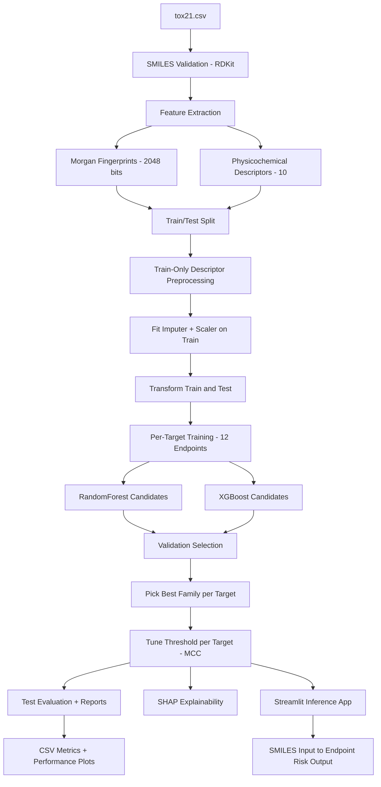
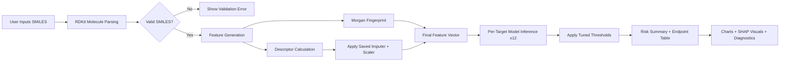
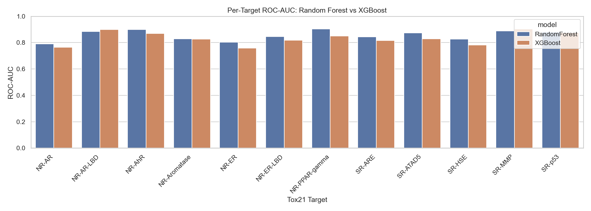
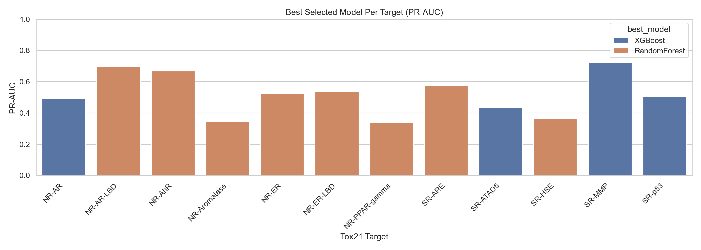
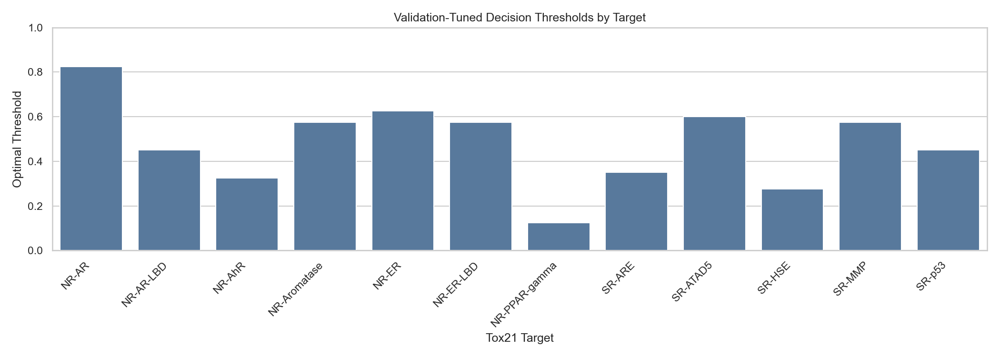
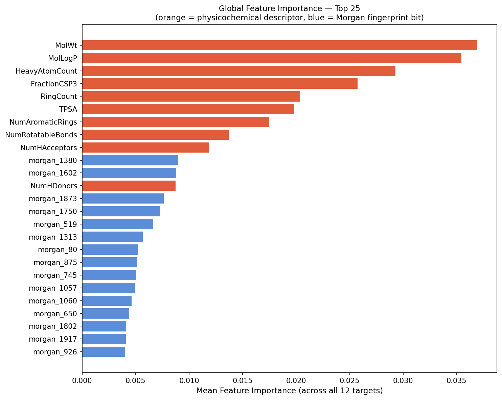
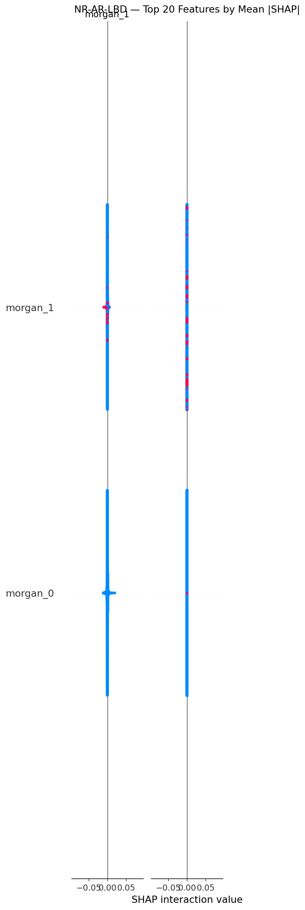

# CodeCure: Multi-Target Drug Toxicity Predictor

CodeCure predicts toxicity risk across 12 Tox21 assay targets from a SMILES string using molecular fingerprints, physicochemical descriptors, model selection, threshold tuning, and SHAP explainability.

## Why This Project
Unexpected toxicity is one of the biggest reasons drug candidates fail. This project provides an early screening workflow to estimate toxicity risk before expensive wet-lab stages.

## Current Highlights
- Mean ROC-AUC (best model per target): 0.851
- Mean PR-AUC (best model per target): 0.517
- Best target ROC-AUC: NR-PPAR-gamma (0.904)
- Selected models across 12 targets: RandomForest (8), XGBoost (4)
- Decision thresholds are tuned per target (not fixed at 0.50)

## Updated Training Approach
- Feature set: Morgan fingerprints (ECFP4, 2048 bits) and 10 physicochemical descriptors.
- Leakage-safe preprocessing: descriptor imputer and scaler are fit on train split only.
- Inference consistency: preprocessing artifacts are saved and reused in app inference.
- Per-target model selection: evaluate RandomForest and XGBoost candidates, then select by validation PR-AUC then ROC-AUC.
- Threshold tuning: optimize MCC on validation set per target and save tuned thresholds.

## End-to-End Pipeline
```text
tox21.csv
  -> SMILES validation (RDKit)
  -> Feature extraction
	  - Morgan fingerprints (2048)
	  - Physicochemical descriptors (10)
  -> Train/test split
  -> Train-only descriptor preprocessing
	  - fit imputer + scaler on train
	  - transform train/test
  -> Per-target model training (12 endpoints)
	  - RandomForest candidates
	  - XGBoost candidates
  -> Validation-based selection
	  - choose best model family per target
	  - tune threshold by MCC
  -> Test evaluation + report generation
	  - model_performance_all_models.csv
	  - model_performance_best_models.csv
	  - performance graphs
  -> SHAP explainability plots
  -> Streamlit app inference
	  - load models + preprocess_artifacts.pkl
	  - predict endpoint risks from SMILES
```

## Pipeline Diagram (Mermaid)


## App Inference Flow (Mermaid)


## Folder Structure
```text
CodeCure/
|-- .gitignore
|-- tox21_preprocess.py
|-- tox21_train.py
|-- tox21_explain.py
|-- app.py
|-- tox21.csv
|-- requirements.txt
|-- README.md
|-- feature_names.npy
|-- X_train.npy
|-- X_test.npy
|-- splits.pkl
|-- target_stats.pkl
|-- models.pkl
|-- preprocess_artifacts.pkl
|-- model_performance_all_models.csv
|-- model_performance_best_models.csv
|-- model_roc_auc_comparison.png
|-- best_model_pr_auc_by_target.png
|-- optimal_thresholds_by_target.png
|-- global_feature_importance.png
|-- shap_bar_NR_AR_LBD.png
|-- shap_beeswarm_NR_AR_LBD.png
|-- shap_waterfall_NR_AR_LBD.png
|-- screenshots/
`-- venv/
```

## Key Output Artifacts
- Models and metadata: models.pkl, splits.pkl, preprocess_artifacts.pkl
- Performance reports: model_performance_all_models.csv, model_performance_best_models.csv
- Performance visuals: model_roc_auc_comparison.png, best_model_pr_auc_by_target.png, optimal_thresholds_by_target.png
- Explainability visuals: global_feature_importance.png, shap_bar_NR_AR_LBD.png, shap_beeswarm_NR_AR_LBD.png, shap_waterfall_NR_AR_LBD.png

## Performance Visuals

### ROC-AUC by Target and Model


### Best Model PR-AUC by Target


### Tuned Decision Thresholds


## Explainability Visuals

### Global Feature Importance


### SHAP Example (NR-AR-LBD)


## Setup
```bash
python -m venv venv
venv\Scripts\activate
pip install -r requirements.txt
```

## Run Pipeline
Make sure tox21.csv is in the project root, then run:

```bash
python tox21_preprocess.py
python tox21_train.py
python tox21_explain.py
streamlit run app.py
```

## Dataset
- Source: https://www.kaggle.com/datasets/epicskills/tox21-dataset
- About 12,000 compounds with 12 toxicity endpoints

## Streamlit App Features
- Predict toxicity from any valid SMILES string
- Best-model-per-target inference option
- Tuned per-target thresholding option
- Risk summary with endpoint-level table and charts
- SHAP-based global and local explanation images

## Notes
- For reproducible results, use the same environment and dependencies from requirements.txt.
- If generated images are missing, rerun tox21_train.py and tox21_explain.py.